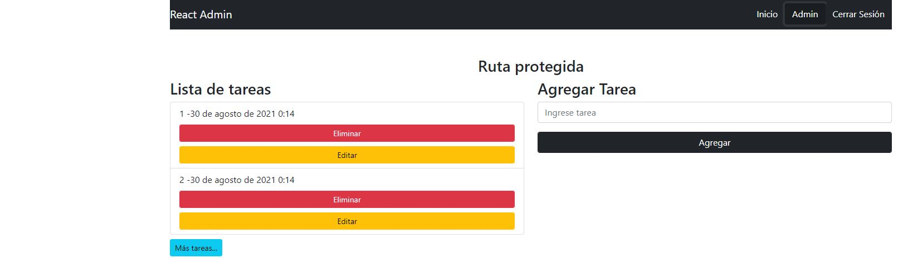

# Desarrollo 

## Para el desarrollo se utilizaron las siguientes tecnologias:

- React.
- React-router-dom
- Firebase.
- React-redux

## Funcionalidad:
* Se creo un un registro para que el usuario se pueda registrar en la aplicacion.
* Ya logueado puedes acceder al admin.
* En admin puedes crear una lista de tareas.
- Se pueden editar y eliminar.
- boton que te trae las tareas de dos en dos.

### Correr el proyecto:

`Para correr el proyecto primero tienes que instalar node_modules con el siguiente comando:`
* npm instal

#### `npm start`

Ejecuta la aplicación en el modo de desarrollo. \
Abre [http://localhost:3000](http://localhost:3000) para verlo en el navegador.

La página se recargará si realiza modificaciones. \
También verá cualquier error de pelusa en la consola.

</img>

